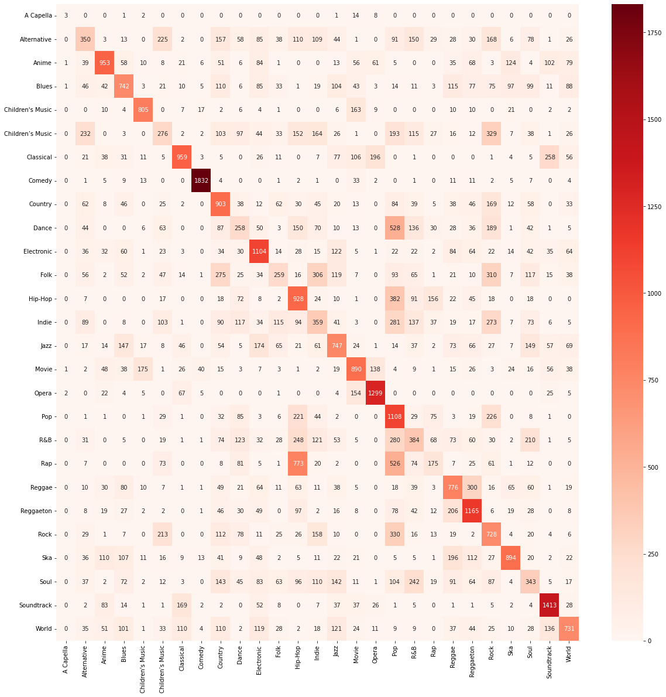
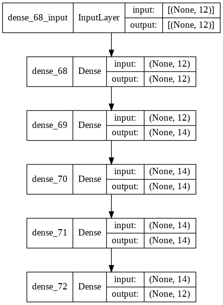

# Music Genre Prediction 

Project for CS4641 Group 40 with Evan Montoya, Ganesh Murugappan, Jason Lee, Charles Luo, and Justin Blalock.

[Video: https://youtu.be/oLWvsiqNnOE](https://youtu.be/oLWvsiqNnOE)

## Introduction
The music streaming industry has exhibited explosive growth with the increasing digitization of entertainment. The leading streaming company, Spotify, has over 360 million users with over 70 million songs in its catalog, and generated over 2.68 billion USD in the 2nd quarter of 2021. Their success is in large part due to both the size of their music catalog and their ability to successfully recommend music; thus, predictive models and relevant data are integral to differentiate themselves from their competition.  

## Problem Definition
Using the attributes of songs on Spotify, we would like to predict a song’s genre based on its features. There exists a plethora of available data describing specific songs that Spotify provides and uses for its categorization and recommendation systems, and we plan to use that for our classification task. We would also like to perform evaluation of similarity between songs, in order to categorize them for a potential recommendation system.

## Data Collection
The data that we will use is sourced from Kaggle under “Spotify Tracks DB”. The dataset contains about 10,000 songs per genre with 26 genres (232,725 total songs) and was obtained using the Spotify API. Each data entry contains 18 relevant variables, with 14 core features including energy, danceability, duration, etc. If we need more data, we can also get these same attributes for songs from the Spotify API.

## Methods

### Data cleaning
To clean the data, we began by ensuring that all features had no NaN or Null values in order to ensure consistency across entries. Following this, we eliminated either esoteric genres such as "Ska" or quasi-genres such as "Movie" in order to focus on more relevant genres. Additional cleaning occured in the form of encoding categorical features (key and time signature) to numerical ones and eliminating data that contained nulls or nans so that each element in our dataset can be used with confidence. 

### Preprocessing/Feature Engineering
Following this, we began to focus on feature engineering. Firstly, categorical features such as Key or Mode were changed to numbers. Secondly, certain features were just generally irrelevant to our intent of classifying songs into genres based on innate characteristics of the music itself, so categories such as "artist_name", "track_id", and "song_name" simply provided no utility to us. Afterwards, genre labels were changed to a one hot encoding as ordinal encoding would not be a good representation of the genres. An integer representation for each unique genre may result in the model associating an ordinal relationship between genres even though there is no positional significance. Thus, the features were one hot encoded to create n features.

Following these fixes, we then normalized and balanced the dataset. To normalize our data, we used MinMaxScaler to scale and translate every feature between 0 and 1, as they previously had inconsistent scale and distribution. Given that our dataset already consists of over 10,000 songs per genre, the data is already balanced.

### Data visualization
The cross correlation matrix for the data was constructed using the seaborn package and may be seen below. 

We discovered correlations in our data to get some intuition on the data before trying to build models.

### Dimensionality Reduction
After our data was fully cleaned, we found through a PCA analysis that we only needed 12 out of our 14 features to retain 99% of the variance in our data. Thus, we were able to further eliminate two unnecessary features.

## Results

### Random Forest
Following this, we were ready to begin applying the ML algorithms themselves. For the midpoint, we focused on two supervised learning algorithms, one of which is RandomForestClassifier. To do this, we capitalized on the sklearn library amd applied a RandomForestClassifier to our dataset, which yielded an accuracy of 45.9%. In addition, we had an f1 score of .44. While not ideal, it demonstrates potential which we will expand upon by the final report. 

We can visualize the mistakes our model is making with a confusion matrix.

As we can see, the model has difficulty telling the difference between similar genres like Hip-Hop and Rap or Dance and Pop. This is expected and this combined with the f1 score shows that perhaps our model could use more complexity because its precision and recall is struggling. That comes with hyperparameter tuning such as the depth of the random forest.

### Neural Network
We created a neural network with 4 hidden layers all using ReLU as an activation function except the output layer which uses softmax.

Our highest accuracy using this method was 45.2%. For the final project we plan on tuning the hyperparameters such as number of hidden layers, number of neurons in each layer, and the activation function used. Though, for both supervised methods, the models aren't doing too badly. There are 14 genres which means random guesses would yield an accuracy of ~7%. So, perhaps the issue is the lack of information provided by our features. Because of this, we decided to begin analyzing audio files instead. 

## A New Dataset
We switched to the GTZAN dataset (http://marsyas.info/downloads/datasets.html). This dataset consists of 10 genres, 100 audio files per genre, and 30 seconds for each audio file. From here, we obtained a dataset with features extracted from the audio file (https://www.kaggle.com/andradaolteanu/gtzan-dataset-music-genre-classification) and used features_3_seconds. This dataset has the same format in its features, but each 30 second clip was split into ten 3 second subsections. This ultimately increases the amount of data by a factor of ten. More data will allow our models to be trained with greater accuracy. This dataset took the .wav files, transformed them into a spectrogram, and then extracted features from the spectrogram and the .wav files. 

General Data Overview             |  Data Categories
  |  

In a similar manner to our previous dataset, we cleaned the data and used feature engineering by getting rid of the filename and length, as they were all the same length. Furthermore, we ensure that there were no null or NA values. Fortunately, the data was already balanced, so from here we simply had to normalize the data. Once again, we used MinMaxScaler to scale and translate the features between 0 and 1, as this controls for inconsistent scale and distrubtion. Once everything was normalized and controlled, we applied PCA on the data as there were 57 features. Setting PCA to retain 99% variance reduced the total number of features to 43. 

We began by creating a new CNN. Firstly, we created a model and used different hperparameters such as the number of nodes in the first and second hidden layer and the learning rate by using keras-tuner. We then trained the model using 70% of the data, used 10% as a means of validation, and tested it on 20% of the data. This yielded a final accuracy of 91%. Additionaly, we applied RandomForest and LogisticRegression to our new dataset, and yielded 82% and 67% accuracy, respectively.

## Discussion
Changing our dataset drastically improved the accuracy of our model. When working with GTZAN, our Convolutional Neural Network was by far our most accurate model, yielding an accuracy of 91%. Our RandomForest Algorithm produced results of 82% accuract, with LogisticRegression lagging behind slightly at 67%. Ultimately, we would consider our CNN to be successful at its target task of accurately classifying the genre of a song. The accuracy of our models increased consistently as we modified them and our datasets. At an accuracy of 91%, it is possible that our model would see some success for assisting in music recommendation algorithms. In future studies, it could be useful to work on classifying subgenres or increasing the size of the dataset. 

## Timeline and Responsibilities
We will have our data cleaned and processed by October 25th. We intend to have the implementation of our first approach by November 8, 2021. We will aim to be able to compare the effectiveness of several approaches by November 28, 2021. We will then have sufficient time to consolidate and write up our results before the deadline. These deadlines will allow us the necessary time to elaborate and improve upon the project before the respective deadlines. With respect to the distribution of our responsibilities, we intend to have each individual focus on a particular approach. Justin Blalock will primarily be responsible for data processing and managing the GitHub. Charlie and Jason will be responsible for working on analyzing actual audio samples. Ganesh will be in charge of the neural networks. Evan will work on the Decision Tree and dimensionality reduction. These responsibilities are subject to change.

## References
- G. Tzanetakis and P. Cook. Musical genre classification of audio signals. IEEE Transactions on Speech and Audio Processing, 10(5):293–302, July 2002.
- Hareesh Bahuleyan. Music genre classification using machine learning techniques. CoRR, abs/1804.01149, 2018. 
- Mingwen Dong. Convolutional neural network achieves human-level accuracy in music genre classification. CoRR, abs/1802.09697, 2018. 
- Pelly, L. (2017). The Problem with Muzak: Spotify’s bid to remodel an industry. The Baffler, 37, 86–95. http://www.jstor.org/stable/26358588
